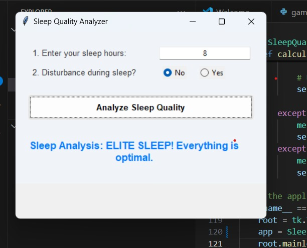

# Sleep Quality Checker

## Overview
This project analyzes your sleep duration and disturbance, then provides feedback on the quality of your sleep. It uses simple inputs and conditional checks to classify results.

## Features
- Accepts user input for sleep hours and disturbance.
- Evaluates if sleep hours are optimal.
- Detects whether sleep disturbance is present.
- Gives an overall sleep quality rating.

## Technologies/tools used
- Python 3.x

## Steps to install & run the project
1. Make sure Python 3.x is installed on your system.
2. Download or copy the `sleep_quality_checker.py` file.
3. Open your command line or terminal.
4. Navigate to the project directory.
5. Run the program using:

